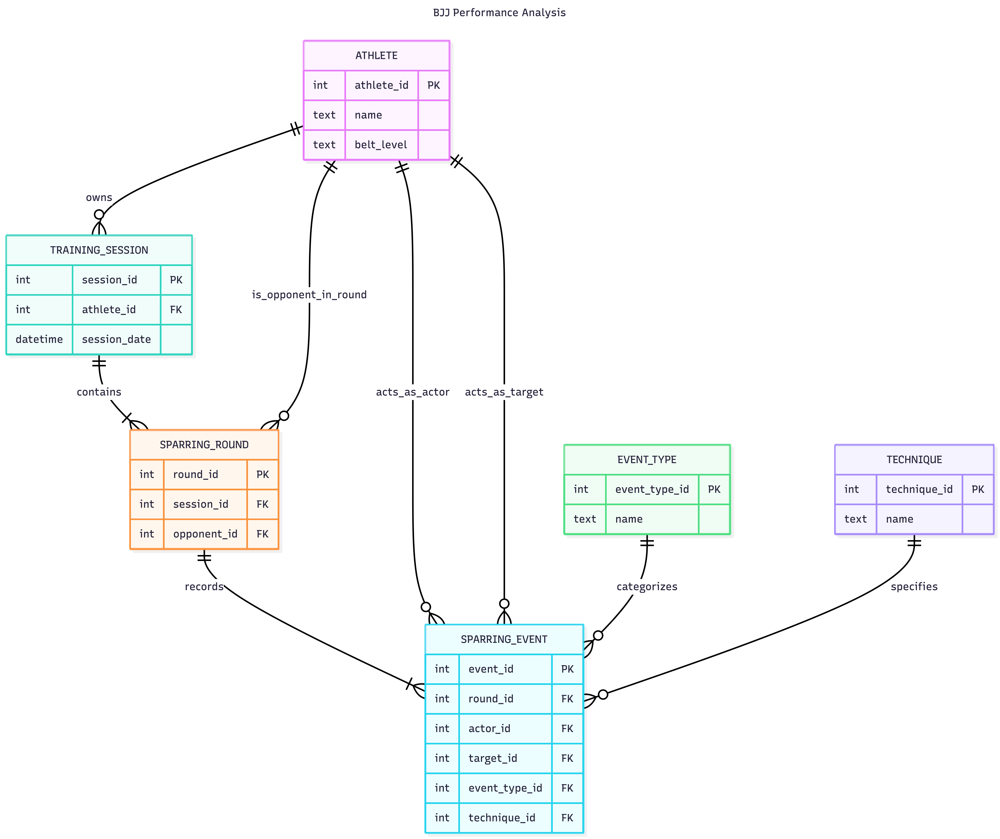

# Design Document

By Efiom Ndaeyo

Video overview: <https://youtu.be/AVmqEQmNKz0?si=2HuXbAv6Nrx_L0FA>

## Scope

This is a relational database that tracks Brazilian Jiu Jitsu (BJJ) training sessions, techniques, and performance outcomes, enabling athletes to analyze progress and optimize training.
Athletes can measure improvement using meaningful performance indicators such as frequency of successful techniques, positional dominance, and effectiveness against different opponents. As such, the database scope includes:

* Athletes: BJJ practitioners who participate in training.
* Training Session: Individual BJJ training sessions or classes.
* Sparring Round: Distinct, time-limited sparring round.
* Sparring Event: Successful execution of a BJJ technique against an opponent.
* Event Type: Abstract category of BJJ actions that is awarded points (e.g., sweeps, takedowns, positional advancement).
* Technique: Specific description or name of the BJJ technique being executed.

Out of scope are elements like video storage, social engagement features, payment systems, and strict enforcement of IBJJF competition rules.

## Functional Requirements

Users of the database should be able to:
* Record training sessions and associated sparring rounds.
* Log multiple sparring rounds against different opponents.
* Record events during sparring rounds.
* Associate events during sparring with specific techniques.
* Analyze athlete performance over time.

The database does not:
* Enforce rules or validate correctness of recorded events.
* Provide real-time analytics during sparring.
* Track physiological data (e.g., heart rate, fatigue).

## Representation

Entities are captured in SQLite tables with the following schema.

### Entities

The database includes the following entities:

#### Athlete
Represents individuals who participate in regular BJJ training.

The `athlete` table includes:

* `athlete_id`, the unique ID for BJJ athletes as an `INTEGER`. This column has the `PRIMARY KEY` constraint.
* `name`, the athlete's name as `TEXT`. `TEXT` is appropriate for name fields.
* `belt_level`, the athlete's rank as `TEXT`. A column constraint ensures that only acceptable input is stored (e.g., 'Purple').
* `weight_class`, the athlete's weight division as `TEXT` (string).
* `age_category`, the athlete's age category as `TEXT` (string). 
* `created_at`, which stores the date and time the athlete record was created using the `NUMERIC` type. This column uses `DEFAULT CURRENT_TIMESTAMP` to automatically capture the insertion time.

##### Design Choices:
* A single athlete table is used to represent both primary athletes and their opponents.
* IBJJF competition divisions are used instead of raw numerical values (e.g., 'Adult' instead of 28 years old).

#### Event_Type
Represents predefined classifications of actions that can occur during sparring, including their scoring rules.

The `event_type` table includes:

* `event_type_id`, the unique ID for an event during sparring, as an `INTEGER`. This column has the `PRIMARY KEY` constraint.
* `name`, the name of the event, as `TEXT`. This column has the `UNIQUE` constraint to avoid duplicates or inconsistent entries.
* `is_submission`, which indicates whether an event represents a submission technique. This is stored as an `INTEGER` flag (0=FALSE, 1=TRUE), with a default value of 0. This allows easy filtering of submission-related events in queries.
* `default_points`, which defines the number of points awarded for the event type, stored as an `INTEGER`. 

##### Design Choices:
* Using a reference table for event types allows the system to be easily extended. For example, new techniques or scoring rules can be added without modifying existing sparring data.
* The inclusion of default_points enables standardized scoring while still allowing flexibility for overrides at the event level if needed.
* The `is_submission` flag simplifies analytical queries, such as calculating submission success rates or filtering submission-only events.

#### Technique
Represents specific Brazilian Jiu Jitsu (BJJ) techniques that can be executed during sparring. 

The `technique` table includes:

* `technique_id`, the unique identifier for each technique as an `INTEGER`. This column has the `PRIMARY KEY` constraint.
* `name`, the name of the technique as `TEXT`.

##### Design Choices:
* The `technique` table separates the specific execution of a move from the broader classification defined in the `event_type` table.
* Storing techniques independently enables more detailed analysis, such as identifying the most frequently used or most effective techniques for an athlete.

#### Training_Session
Represents a Brazilian Jiu Jitsu (BJJ) class or training session during which sparring activities are recorded.

The `training_session` table includes:

* `session_id`, the unique identifier for each training session as an `INTEGER`. This column has the `PRIMARY KEY` constraint.
* `athlete_id`, the athlete whose performance is being tracked during the session, as an `INTEGER`. This column is a `FOREIGN KEY` referencing `athlete`(`athlete_id`), ensuring referential integrity.
* `session_date`, which stores the date the training session occurred. This column uses the `DATETIME` type to clearly represent temporal data.
* `notes`, which stores optional comments about the training session as `TEXT`. This column allows `NULL` values, making it optional.

##### Design Choices:
* Each training session is associated with a single athlete (Athlete A), representing the primary subject of performance analysis. Opponents are recorded separately in sparring-related tables, allowing flexible modeling of interactions.
* Storing timestamps enables time-based queries, such as filtering sessions by date range or analyzing performance trends over time.

#### Sparring_Round
Represents individual sparring rounds that occur during a BJJ training session. 

The `sparring_round` table includes:

* `round_id`, the unique identifier for each sparring round as an `INTEGER`. This column has the `PRIMARY KEY` constraint.
* `session_id`, the training session in which the sparring round occurred. This column is a `FOREIGN KEY` referencing `training_session`(`session_id`). The column has the `ON DELETE CASCADE` constraint.
* `opponent_id`, the athlete who participates in the round against the primary athlete (Athlete A). This column is a `FOREIGN KEY` referencing `athlete`(`athlete_id`). The column has the `ON DELETE RESTRICT` constraint. 
* `duration`, which records the length of time (minutes) for the sparring round, as an `INTEGER`. A `CHECK` constraint ensures that only reasonable values are stored.

##### Design Choices:
* A sparring round can only happen during a training session.
* Each round models an interaction between two participants: the primary athlete (linked via the `training_session`(`athlete_id`)) and an opponent (linked via `opponent_id`).
* The `opponent_id` creates a self-referential relationship within the `athlete` table, allowing all participants to be stored in a single unified entity without duplication.

#### Sparring_Event
Represents individual actions performed between athletes during sparring rounds.

The `sparring_event` table includes:

* `event_id`, the unique identifier for each sparring event as an `INTEGER`. This column has the `PRIMARY KEY` constraint.
* `round_id`, the sparring round in which the event occurred, as an `INTEGER`. This column is a `FOREIGN KEY` referencing `sparring_round`(`round_id`). The column has the `ON DELETE CASCADE` constraint.
* `actor_id`, the athlete who performed the action, as an `INTEGER`. This column is a `FOREIGN KEY` referencing `athlete`(`athlete_id`). The column has the `ON DELETE RESTRICT` constraint. 
* `target_id`, the athlete on whom the action was performed, as an `INTEGER`. This column is a `FOREIGN KEY` referencing `athlete`(`athlete_id`). The column has the `ON DELETE RESTRICT` constraint.
* `event_type_id`, which specifies the type of action performed, as an `INTEGER`. This column is a `FOREIGN KEY` referencing `event_type`(`event_type_id`). The column has the `ON DELETE RESTRICT` constraint. 
* `technique_id`, the technique used to execute the action, as an `INTEGER`. This column is a `FOREIGN KEY` referencing `technique`(`technique_id`). The `ON DELETE SET NULL` constraint allows the technique to be optional.

##### Design Choices:
* The `sparring_event` table is the core of the database, capturing granular interactions between athletes. All performance analysis is derived from these recorded events.
* The use of both `actor_id` and `target_id` enables modeling of directional interactions, allowing analysis of both offensive actions (performed by the actor) and defensive outcomes (experienced by the target).
* The event-based design provides flexibility and scalability, allowing new event types and techniques to be incorporated without altering the schema.

### Relationships

The below entity relationship diagram describes the relationships among the entities in the database.

The database includes the following relationships:
* An athlete can have many training sessions (one-to-many relationship).
* A training session can have many sparring rounds (one-to-many relationship).
* Each sparring round involves two athletes: the primary athlete (Athlete A), linked through the training session, and an opponent (Athlete B), linked via a foreign key in the `sparring_round` table.
* A sparring round can have many sparring events (one-to-many relationship).
* An athlete can participate in many sparring events, either as the actor (performing an action) or as the target (receiving an action), forming two distinct relationships with the `sparring_event` table.
* Each sparring event is associated with one event type, while an event type can be associated with many sparring events (many-to-one relationship).
* Each sparring event may optionally reference a technique, allowing flexibility as not all events require a specific technique classification (many-to-one relationship).

## Optimizations

To improve query performance, indexes were created on the `sparring_event` table, which serves as the core table for performance analysis. Since most analytical queries involve filtering and aggregating data from this table, indexing key foreign key columns significantly reduces query execution time.

The following indexes were implemented:

* An index on `sparring_event`(`actor_id`) to optimize queries that analyze actions performed by a specific athlete, such as calculating total points scored or frequency of techniques used.
* An index on `sparring_event`(`target_id`) to improve performance of queries that analyze defensive performance, such as tracking how often an athlete concedes points or is subjected to specific techniques.
* An index on `sparring_event`(`round_id`) to optimize queries that filter events within a specific sparring round, enabling efficient retrieval of round-level performance data.

While individual indexes were sufficient for the current scope of queries, a composite index (e.g., on (`actor_id`, `round_id`)) could be considered for further optimization of more complex filtering conditions. Views were not implemented, as the current queries can be efficiently executed using indexed tables.

## Limitations

* The database relies on manual data entry, which may result in incomplete or inaccurate records if events are missed or incorrectly logged.
* The schema does not capture contextual factors such as fatigue, injuries, or fitness levels, limiting the ability to explain performance outcomes.
* While constraints enforce structural integrity, they cannot guarantee data accuracy; incorrect or dishonest inputs may lead to misleading analysis.

